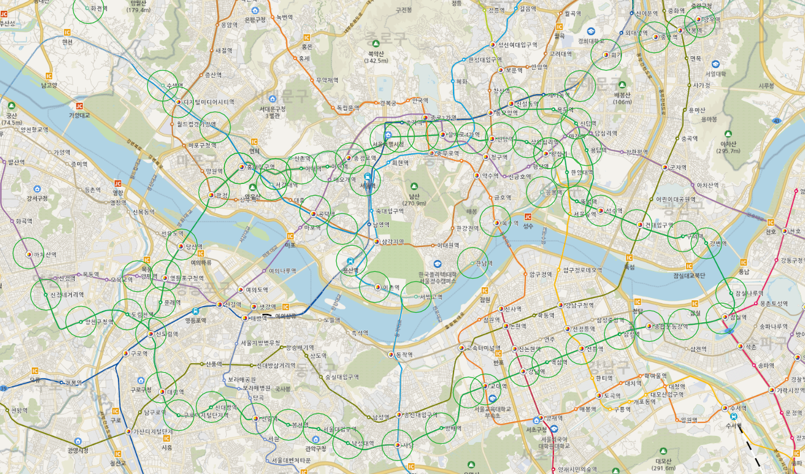
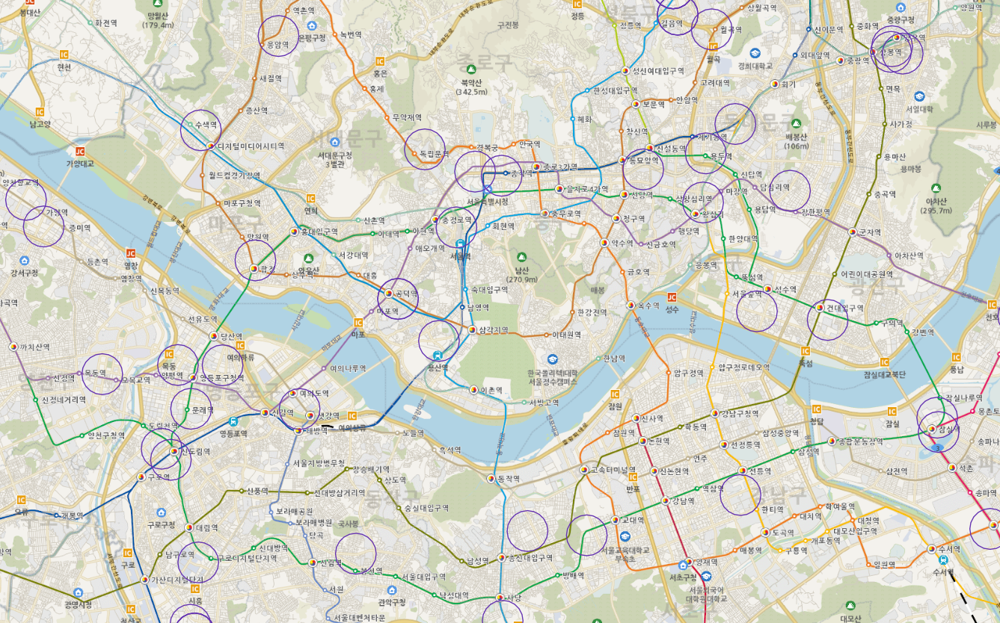
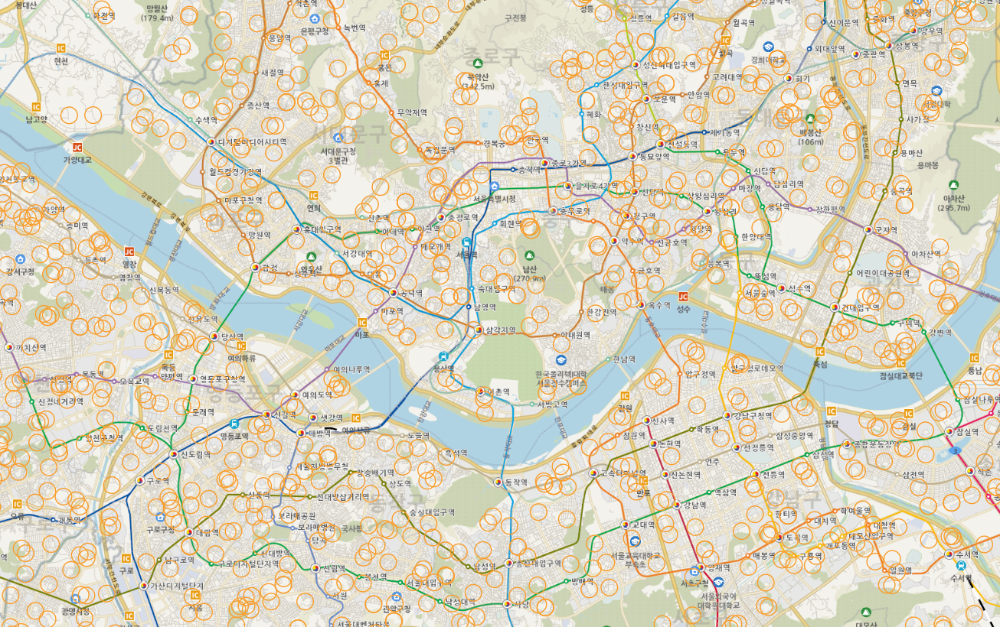
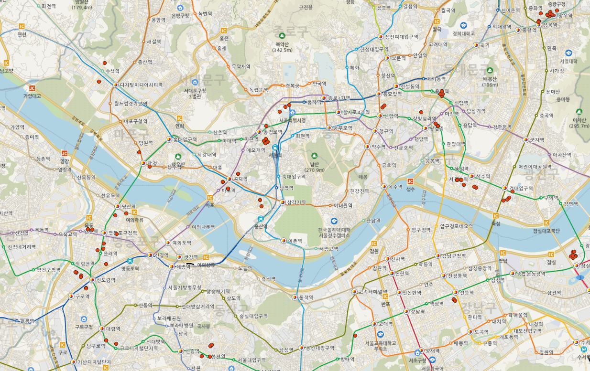
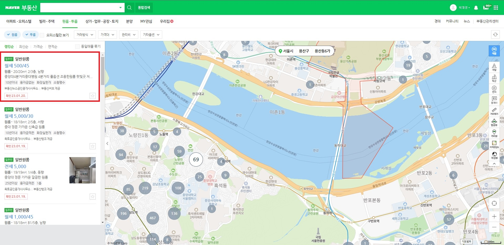
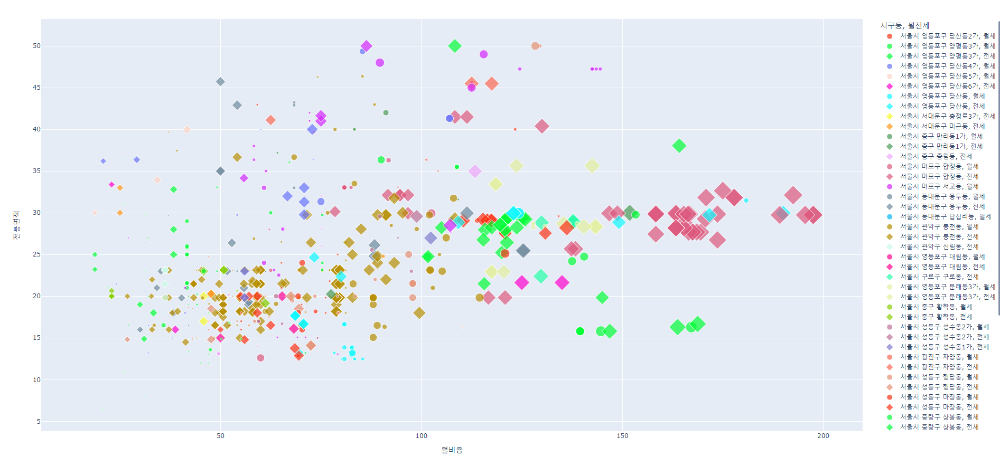
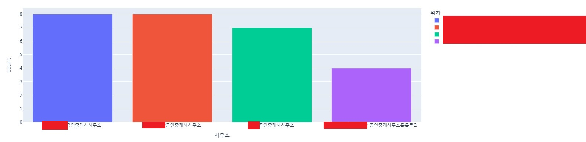

# 지방러 자취방 구하기 데이터 분석
## 개요
---

취직준비를 하기 위해 서울에서 자취방을 구해야 하는데 서울의 특징을 잘 모르는 지방 사람이라  원하는 기준의 데이터를 가지고 자취방을 분석해보았습니다.

## 자취방 기순 수립

---

1. 교통 시설 (지하철 2호선) 
    - 지하철 좌표  (2018 년 기준이라서 폐기)
    
    [https://gaussian37.github.io/python-etc-수도권-지하철/](https://gaussian37.github.io/python-etc-%EC%88%98%EB%8F%84%EA%B6%8C-%EC%A7%80%ED%95%98%EC%B2%A0/)
    
    - 지하철 호선
    
    [https://data.seoul.go.kr/dataList/OA-15442/S/1/datasetView.do](https://data.seoul.go.kr/dataList/OA-15442/S/1/datasetView.do)
    
    - 지하철 호선 (전국)
    
    [https://blog.naver.com/PostList.naver?blogId=yug311861&from=postList&categoryNo=380](https://blog.naver.com/PostList.naver?blogId=yug311861&from=postList&categoryNo=380)
    
    - 2호선, 경의선
2. 대형 마트 (raw_data EPSG : 5174 )
    
    [https://www.data.go.kr/data/15045013/fileData.do?recommendDataYn=Y](https://www.data.go.kr/data/15045013/fileData.do?recommendDataYn=Y)
    
    - 서울특별시, 경기도
    - 정상영업
    - 대형마트
3. 공간 시설 
    
    [http://data.nsdi.go.kr/dataset/15153](http://data.nsdi.go.kr/dataset/15153)
    
    - 공원 데이터 추출
4. 학교 정화구역 
    
    [https://www.data.go.kr/data/15021148/standard.do?recommendDataYn=Y](https://www.data.go.kr/data/15021148/standard.do?recommendDataYn=Y)
    

## 데이터 위치 좌표 수집

---

point → 거리에 맞게 폴리곤(버퍼)으로 생성

### 필수적인거

1. 지하철 도보로 5분거리을 기준으로 500m

2. 대형마트 (500)

3. 학교 정화구역 (200)

### 있으면 좋은거

1. 공원시설 (갯수 세기)  
    
    폴리곤 내부안에 폴리곤 갯수를 세고 싶은데 방법을 잘모르겠다
    
    폴리곤아에 공원을 세기
    

### 교차 구역 만들기

- 필수적인거 3개를 이용하여 교차 시설 만들기
- 중심점 생성

### 네이버 부동산 크롤링

교착점을 기준으로 네이버 부동산에서 가격, 소재지, 면적, 관리비 등의 데이터를 수집합니다.

### 데이터 시각화

수집한 데이터를 알아보기 쉽게 산점도로 시각화를 해줍니다 

- 색깔 : 행정동 기준
- 모양 : 마름모 : 전세, 원형 : 월세
- 크기 : 보증금 액수
- y축 : 전용면적 (거주자가 독점적으로 사용하는 면적)
- x축 : 월비용
    - 월세 기준 : 보증금(기회비용 연 5%) + 관리비 + 월세
    - 전세 기준 : 보증금(기회비용 연 5%) + 관리비

<iframe id="igraph" scrolling="no" style="border:none;" seamless="seamless" src="https://plotly.com/~wodud2970/1.embed" height="525" width="100%"></iframe>

시각화를 통해 제가 원하는 주거형태의 위치, 월비용, 전용면적을 쉽게 찾을 수 있었습니다.

- 월비용과 전용면적 필터를 기준으로 원하는 주거형태의 매물을 많이 가지고 공인중개소를 막대그래프로 시각화

이를 통해서 제가 원하는 매물과 매물을 많이 가지고 있는 공인중개사를 추릴 수 있었고 수월하게 집을 구할 수 있었습니다.

ps : 부동산 분석이 처음이라 피드백은 언제든 환영입니다 ㅎ

